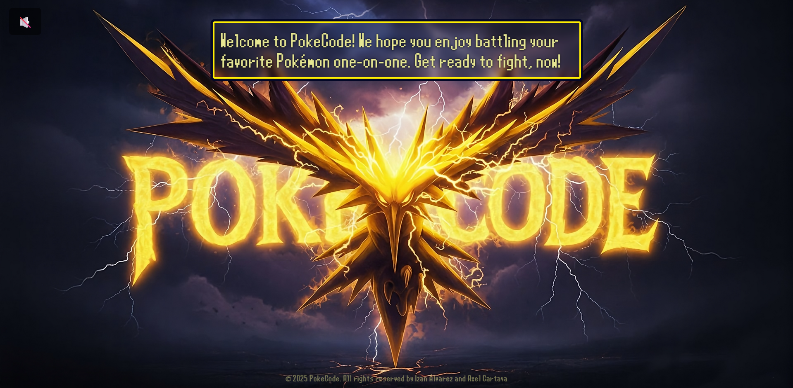
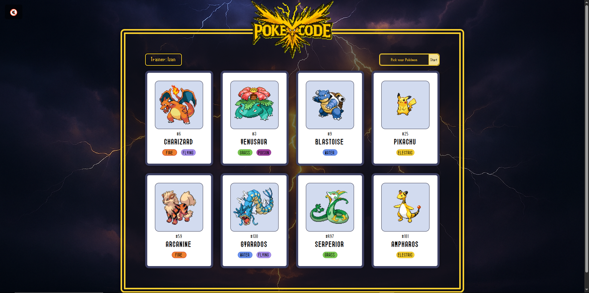
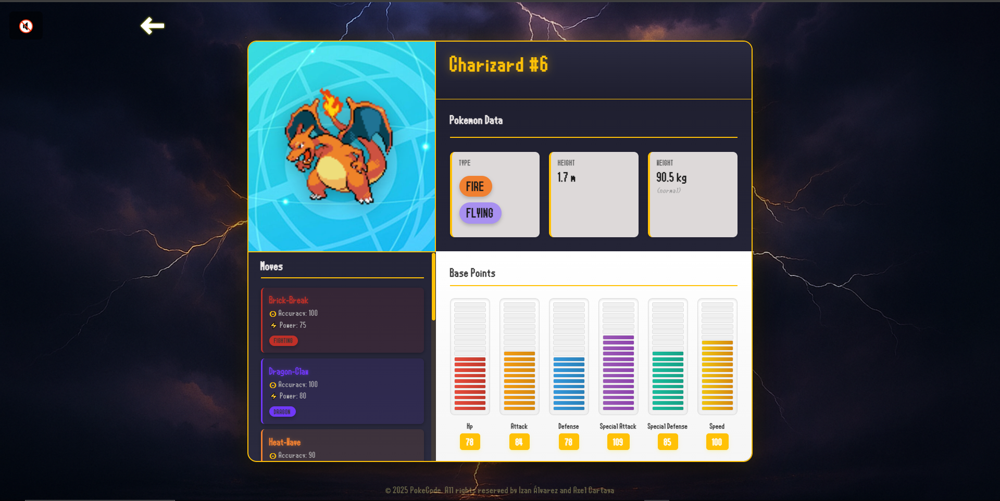
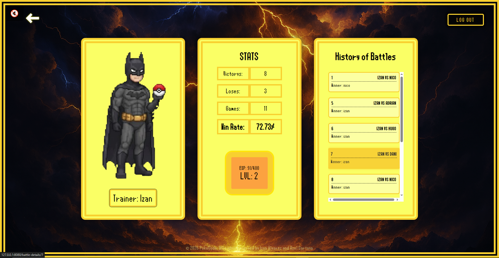
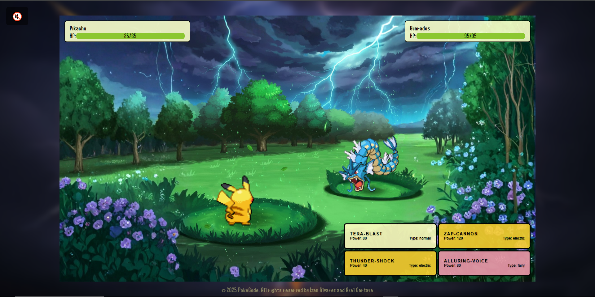
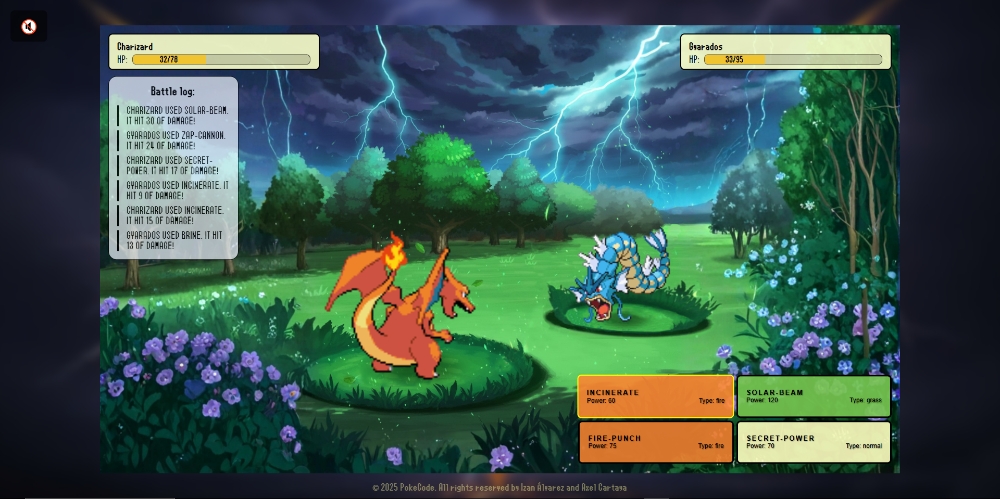
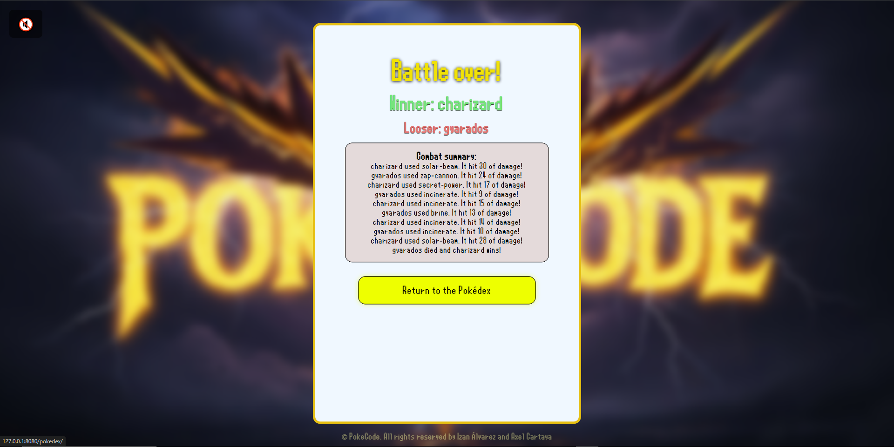

 # PokeCode 

PokeCode is a project that we made for the Server Environment signature where we built a small platform to simulate battles and display results of the combats of the Pokemons.

## Description
This repository was created as an exercise to understand client/server architectures and turn-based battle logic using the Flask framework (Python). We used FlaskSession and Jinja templates to render the backend into the front-end.

We also gave the project our own style, both visually with a retro Nintendo-like look and functionally (for example, background music similar to the original games).

## Views 

- Initial screen (Welcome)



- PokeDex (Pokemon selection)



- Pokemon Details 



-Profile page



- Battle Details Page


- Main Battle screen



- Logs and battle details



- Final Page (Winner and loser)




Others: 

- Error page


## Installation (using virtual environment)
**1. Clone repository:**
```
git clone https://github.com/Izan206/PokeCode.git
```
**2. Create a virtual environment:**
```
python -m venv .venv
```

**3. Install dependencies:**
```
./venv/Scripts/pip.exe install -r requirements.txt
```

**4. Create the database**
```
./venv/Scripts/flask.exe --app app.main create-tables
```
**5. Run the app**
With the virtual environment activated, start the app:
```
./.venv/Scripts/python.exe -m app.main
```

Typical development output:
 * Serving Flask app 'main'
 * Debug mode: on
WARNING: This is a development server. Do not use it in a production deployment. Use a production WSGI server instead.
 * Running on all addresses (0.0.0.0)
 * Running on http://127.0.0.1:8080
Press CTRL+C to quit
 * Restarting with stat
 * Debugger is active!

Open your browser at http://127.0.0.1:8080 (or the shown address).


## API: PokeAPI 


For this project, we used the PokeAPI public API. We worked with it to obtain different data and adapt it to the needs of our projects. We ensured that the information was received correctly and optimized the code by using caching for request processing and website speed.

To accomplish this, we created a client-side section where we handle the aforementioned tasks.

Link to the API: https://pokeapi.co/

## License
MIT License.

## Authors
Made by: 

- Izan Álvarez Varela
- Axel Cartaya Delgado

